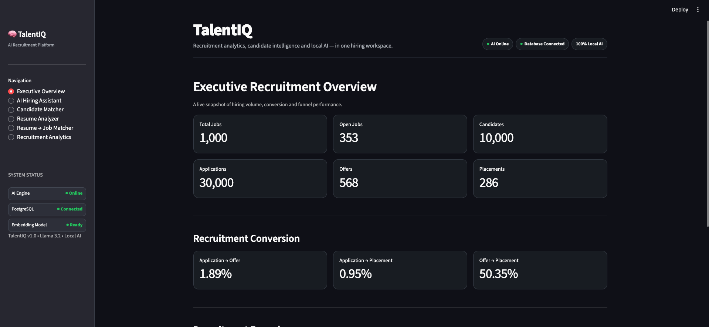
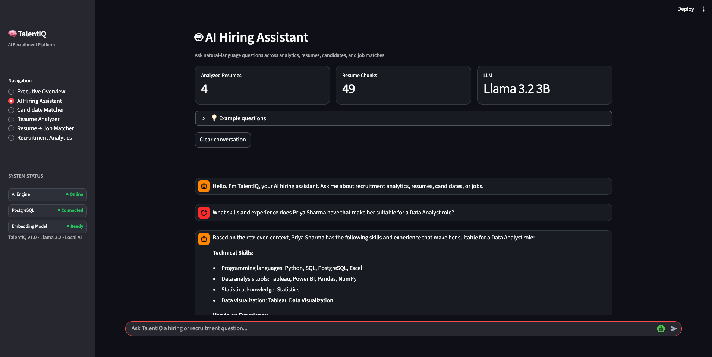
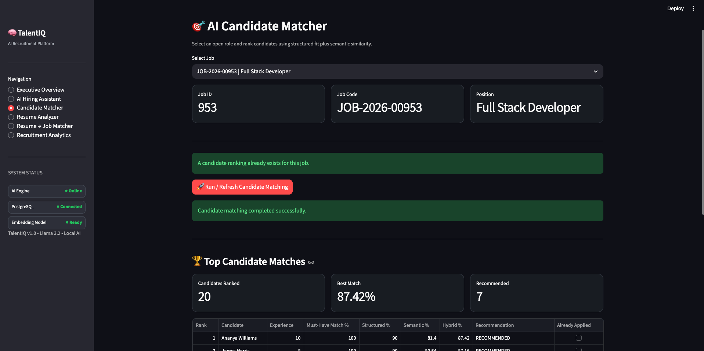
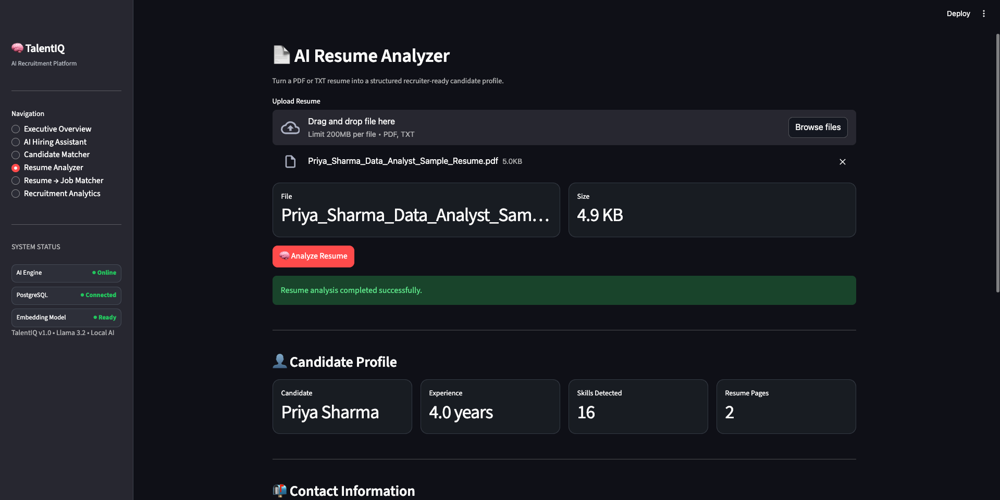
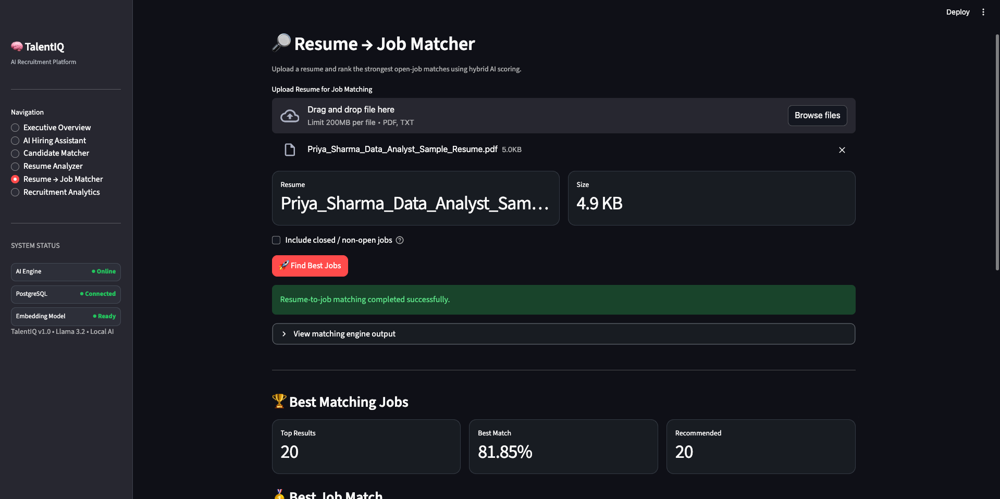
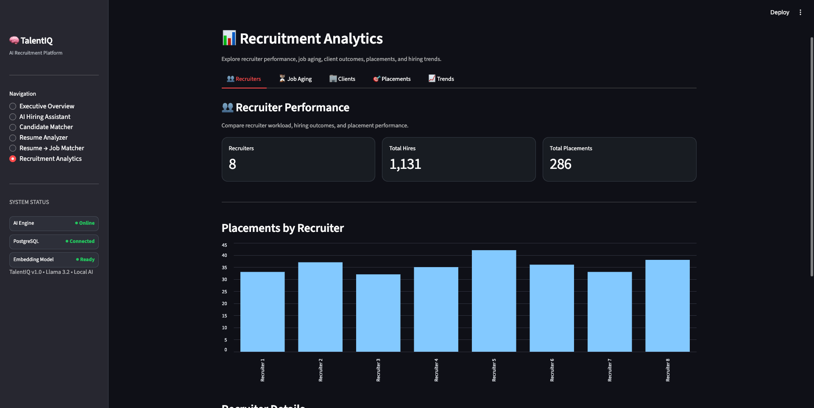

# TalentIQ — AI Recruitment Analytics & Intelligent Hiring Platform

**TalentIQ** is an end-to-end recruitment analytics and AI hiring platform built with **PostgreSQL, Python, Streamlit, Tableau, Sentence Transformers, and a local Llama 3.2 model through Ollama**.

The project combines traditional recruitment analytics with AI-powered candidate matching, semantic search, resume intelligence, and Retrieval-Augmented Generation (RAG).

It is designed to demonstrate how recruitment teams can transform raw hiring data into actionable insights while using AI to improve candidate discovery and job matching.

---

## Screenshots

### Executive Overview


### AI Hiring Assistant


### Candidate Matcher


### Resume Analyzer


### Resume → Job Matcher


### Recruitment Analytics

## Project Highlights

* **1,000 Jobs**
* **10,000 Candidates**
* **30,000 Applications**
* **12,426 Interviews**
* **568 Offers**
* **286 Placements**
* **8 Recruiters**
* **54 Skills**
* **353 Open Jobs**
* **100% Data Quality Validation Score**
* **106 / 106 Data Quality Checks Passed**

The dataset used in this project is **synthetic** and was generated specifically for portfolio and analytical purposes.

---

# Business Problem

Recruitment teams often work across multiple disconnected systems:

* Applicant Tracking Systems
* Job portals
* spreadsheets
* recruiter reports
* resumes
* client requirements
* interview records
* placement information

This makes it difficult to answer important business questions such as:

* Which recruiters are performing best?
* Where are candidates dropping out of the hiring funnel?
* Which jobs have remained open too long?
* Which clients generate the most placements?
* Which candidates are the best match for a job?
* Which jobs best match a candidate's resume?
* What skills and experience does a candidate have?
* Can recruiters ask recruitment questions using natural language?

TalentIQ brings these workflows together into a single analytical and AI-powered platform.

---

# Solution Overview

TalentIQ contains five major layers:

1. **PostgreSQL Recruitment Database**
2. **SQL & Python Recruitment Analytics**
3. **AI Candidate and Resume Matching**
4. **Local RAG Hiring Assistant**
5. **Streamlit + Tableau Presentation Layer**

## System Architecture

```mermaid
flowchart TD

    A[Recruitment Data Generation] --> B[(PostgreSQL Database)]

    B --> C[SQL Analytics Layer]
    C --> D[Dashboard Views]
    D --> E[Tableau Dashboards]
    D --> F[Streamlit Recruitment Analytics]

    B --> G[Python Analytics]
    G --> H[Data Quality Validation]
    G --> I[Feature Engineering]

    B --> J[Structured Candidate Matcher]
    I --> J

    J --> K[Semantic Candidate Matcher]
    L[Sentence Transformers<br/>all-MiniLM-L6-v2] --> K

    M[Resume PDF / TXT] --> N[Resume Analyzer]
    N --> O[Resume Profile + Extracted Skills]

    O --> P[Resume → Job Matcher]
    B --> P
    L --> P

    O --> Q[RAG Retrieval Layer]
    B --> Q
    K --> Q

    Q --> R[Intent Router]
    R --> S[Local Llama 3.2 via Ollama]

    S --> T[AI Hiring Assistant]

    J --> U[Streamlit App]
    K --> U
    N --> U
    P --> U
    T --> U

    U --> V[Recruiter / Hiring Manager]
    E --> V

The platform supports both structured recruitment analytics and unstructured resume intelligence.

---

# Core Features

## 1. Executive Recruitment Analytics

Management-level recruitment KPIs including:

* Total Jobs
* Open Jobs
* Total Candidates
* Total Applications
* Total Offers
* Total Placements
* Application → Offer Rate
* Application → Placement Rate
* Offer → Placement Rate
* Average Days to Placement

---

## 2. Recruitment Funnel Analysis

Tracks candidates across the recruitment lifecycle:

```text
Applied
   ↓
Screening
   ↓
Submitted to Client
   ↓
Interview
   ↓
Offer
   ↓
Hired
```

The platform also analyzes:

* Rejections
* Withdrawals
* stage distributions
* hiring conversion rates

---

## 3. Recruiter Performance Analytics

Recruiter performance is evaluated using:

* Applications handled
* Interviews
* Offers
* Hires
* Placements
* Hire rate
* Placement rate
* Performance score
* Application aging

TalentIQ currently contains **8 recruiters** distributed across the recruitment dataset.

---

## 4. Job Aging Analytics

Open jobs are categorized into aging buckets:

```text
0–29 Days
30–59 Days
60–89 Days
90+ Days
```

This allows recruitment managers to quickly identify:

* aging requisitions
* long-running open positions
* jobs receiving applications but producing no placements
* jobs requiring recruiter or client intervention

---

## 5. Client Performance Analytics

TalentIQ analyzes hiring performance by client using metrics such as:

* Total Jobs
* Open Jobs
* Filled Jobs
* Applications
* Offers
* Placements
* Placement Rate
* Average Offered Salary

---

# AI Candidate Matching Engine

TalentIQ includes a structured candidate matching engine that evaluates candidates against job requirements.

The scoring system evaluates:

* Skill Match
* Must-Have Skill Match
* Nice-to-Have Skills
* Experience Match
* Location Match

For a selected job, the engine can evaluate all **10,000 candidates** and return ranked recommendations.

Example test:

```text
Job: JOB-2026-00953
Role: Full Stack Developer

Candidates Evaluated : 10,000
Excellent Matches    : 4
Strong Matches       : 16
Top Score            : 90.00%
```

Recommendations include:

```text
HIGHLY RECOMMENDED
RECOMMENDED
REVIEW
```

---

# Semantic + Hybrid Candidate Matching

TalentIQ goes beyond keyword matching by using:

**Sentence Transformers**

```text
sentence-transformers/all-MiniLM-L6-v2
```

Candidate and job profiles are converted into embeddings and compared using semantic similarity.

The final hybrid score combines:

```text
Structured Recruitment Score
            +
Semantic Similarity Score
            =
Hybrid Candidate Match Score
```

This allows TalentIQ to identify candidates who may be relevant even when their resume wording differs from the job description.

---

# Resume Analyzer

TalentIQ can analyze PDF and text resumes.

The resume engine extracts:

* Candidate Name
* Email
* Phone
* Estimated Experience
* Technical Skills
* Possible Job Roles
* Education
* Cleaned Resume Text

Example demo profile:

```text
Candidate          : Priya Sharma
Experience         : 4 Years
Skills Detected    : 16
Detected Roles     : Data Analyst, Business Analyst
Education          : B.Tech
```

A fictional resume is included in the repository for safe demonstration.

---

# Resume → Job Matching Engine

TalentIQ can rank open jobs against an uploaded candidate resume.

The engine combines:

* resume skill extraction
* job requirements
* experience matching
* must-have skill matching
* structured scoring
* semantic embeddings
* hybrid ranking

Example result:

```text
Candidate     : Priya Sharma
Best Match    : Data Analyst
Job Code      : JOB-2026-00081
Hybrid Score  : 81.85%
Skill Match   : 100%
Experience    : 100%
Must-Have     : 100%
```

The test evaluated all **353 open jobs** with:

```text
Validation Failures : 0
Status              : PASS
```

---

# AI Hiring Assistant — Hybrid RAG

TalentIQ includes a natural-language hiring assistant.

The assistant can answer questions related to:

* Recruitment KPIs
* Recruitment Funnel
* Recruiter Performance
* Job Aging
* Candidate Matching
* Resume Analysis
* Resume → Job Matching

Example:

```text
Question:
What are the skills of Priya Sharma?

Detected Intent:
resume

TalentIQ:
Generates a grounded response using retrieved resume context.
```

The assistant uses a hybrid architecture combining:

```text
User Question
      ↓
Intent Router
      ↓
Structured Database / Resume Retrieval
      ↓
Sentence Transformer Embeddings
      ↓
Relevant Context
      ↓
Local Llama 3.2
      ↓
Grounded Answer
```

---

# Local AI Architecture

TalentIQ does **not require a paid LLM API**.

The current AI stack uses:

* **Ollama**
* **Llama 3.2 3B**
* **Sentence Transformers**
* **Local embeddings**
* **Local inference**

Default configuration:

```text
OLLAMA_HOST=http://localhost:11434
OLLAMA_MODEL=llama3.2:3b
```

This keeps the AI workflow local and makes the project inexpensive to run.

---

# Streamlit Application

TalentIQ provides an interactive Streamlit application with six modules:

```text
1. Executive Overview
2. AI Hiring Assistant
3. Candidate Matcher
4. Resume Analyzer
5. Resume → Job Matcher
6. Recruitment Analytics
```

The Recruitment Analytics module contains:

```text
Recruiters
Job Aging
Clients
Placements
Trends
```

---

# Tableau Dashboards

The analytics layer also feeds four Tableau dashboards.

### 01 — Executive Recruitment Overview

Focus:

* Executive KPIs
* Recruitment funnel
* Monthly recruitment trends
* Pipeline metrics
* Hiring and placement performance

### 02 — Recruiter Performance

Focus:

* recruiter applications
* hires
* placement rate
* recruiter funnel
* recruiter performance comparison

### 03 — Job & Client Performance

Focus:

* job aging
* top open jobs
* applications by job
* placements by client
* client placement rate

### 04 — Candidate & Placement Insights

Focus:

* candidate experience
* candidate status
* salary insights
* placements by department
* placement outcomes

---

# Technology Stack

| Layer                | Technology                 |
| -------------------- | -------------------------- |
| Database             | PostgreSQL                 |
| Query Language       | SQL                        |
| Analytics            | Python, Pandas, NumPy      |
| Database Integration | SQLAlchemy, psycopg2       |
| Data Generation      | Faker                      |
| Application          | Streamlit                  |
| Resume Parsing       | PyPDF                      |
| Embeddings           | Sentence Transformers      |
| Embedding Model      | all-MiniLM-L6-v2           |
| Local LLM            | Llama 3.2 3B               |
| LLM Runtime          | Ollama                     |
| BI / Visualization   | Tableau                    |
| Version Control      | Git                        |
| Environment          | Python Virtual Environment |

---

# Database Design

TalentIQ uses a normalized PostgreSQL recruitment schema containing **15 primary tables**.

Key tables include:

```text
companies
recruiters
departments
locations
sources
skills
work_authorizations
candidates
candidate_skills
jobs
job_skills
applications
interviews
offers
placements
```

Relationships connect the complete recruitment lifecycle:

```text
Candidate
   ↓
Application
   ↓
Interview
   ↓
Offer
   ↓
Placement
```

Jobs are connected to:

```text
Recruiters
Departments
Clients
Vendors
Locations
Skills
```

---

# Tableau Analytics Layer

PostgreSQL views provide a reusable analytics layer for Tableau and Streamlit.

Key views include:

```text
vw_dashboard_executive_kpis
vw_dashboard_recruitment_funnel
vw_dashboard_application_status
vw_dashboard_job_performance
vw_dashboard_job_aging
vw_dashboard_recruiter_performance
vw_dashboard_candidate_analysis
vw_dashboard_client_analysis
vw_dashboard_placement_analysis
vw_dashboard_salary_analysis
vw_dashboard_time_trends
vw_dashboard_master
```

---

# Data Quality & Validation

TalentIQ includes an automated Python data-quality framework.

Validation covers:

* Primary key uniqueness
* Required field validation
* Null checks
* Foreign-key integrity
* Recruitment funnel consistency
* Offer validation
* Placement validation
* KPI reconciliation
* Dashboard view validation
* Match score validation

Latest validation result:

```text
Total Checks : 106
Passed       : 106
Failed       : 0
Errors       : 0
Health Score : 100%
Status       : PASS
```

---

# Key Recruitment KPIs

Latest synthetic dataset snapshot:

| KPI                       |  Value |
| ------------------------- | -----: |
| Total Jobs                |  1,000 |
| Open Jobs                 |    353 |
| Candidates                | 10,000 |
| Applications              | 30,000 |
| Interviews                | 12,426 |
| Offers                    |    568 |
| Placements                |    286 |
| Hired Applications        |  1,131 |
| Application → Offer       |  1.89% |
| Application → Placement   |  0.95% |
| Offer → Placement         | 50.35% |
| Average Days to Placement |  41.53 |

---

# Project Structure

```text
TalentIQ_AI_Recruitment_Analytics/
│
├── analytics/
│   ├── exports/
│   └── sql/
│
├── app/
│   └── app.py
│
├── dashboard/
│   └── tableau/
│
├── database/
│   ├── 01_database_setup.sql
│   ├── 02_schema.sql
│   ├── 03_create_tables.sql
│   ├── 04_constraints.sql
│   ├── 05_indexes.sql
│   ├── 06_seed_master_data.sql
│   └── 06_views.sql
│
├── docs/
│   ├── Business Requirements
│   ├── Functional Requirements
│   ├── User Flow
│   └── Database Designs
│
├── outputs/
│   ├── predictions/
│   └── reports/
│
├── resumes/
│   └── Priya_Sharma_Data_Analyst_Sample_Resume.pdf
│
├── src/
│   ├── database/
│   └── talentiq/
│       ├── ai/
│       │   ├── embeddings/
│       │   ├── matching/
│       │   ├── rag/
│       │   └── resume/
│       │
│       └── analytics/
│
├── .env.example
├── .gitignore
├── LICENSE
├── README.md
└── requirements.txt
```

---

# Installation

## 1. Clone the Repository

```bash
git clone <repository-url>
cd TalentIQ_AI_Recruitment_Analytics
```

## 2. Create a Virtual Environment

```bash
python -m venv venv
source venv/bin/activate
```

Windows:

```bash
venv\Scripts\activate
```

## 3. Install Python Dependencies

```bash
pip install -r requirements.txt
```

---

# Environment Configuration

Create a `.env` file using `.env.example` as a template.

```env
DB_USER=postgres
DB_PASSWORD=your_postgres_password
DB_HOST=localhost
DB_PORT=5432
DB_NAME=recruitment_analytics

OLLAMA_HOST=http://localhost:11434
OLLAMA_MODEL=llama3.2:3b
```

Never commit the real `.env` file.

---

# PostgreSQL Setup

Create the TalentIQ database and execute the SQL files in the `database/` directory.

The main database is:

```text
recruitment_analytics
```

The main PostgreSQL schema is:

```text
recruitment
```

---

# Ollama Setup

Install Ollama and download the local model:

```bash
ollama pull llama3.2:3b
```

Verify installation:

```bash
ollama list
```

---

# Run the Streamlit Application

From the project root:

```bash
PYTHONPATH=src streamlit run app/app.py
```

Streamlit will provide a local browser URL.

---

# Run Data Quality Validation

```bash
PYTHONPATH=src python src/talentiq/analytics/data_quality.py
```

Expected result:

```text
Health Score : 100%
Status       : PASS
```

---

# Run Recruitment Analytics

```bash
PYTHONPATH=src python src/talentiq/analytics/recruitment_analysis.py
```

---

# Run Candidate Matching

Example:

```bash
PYTHONPATH=src python src/talentiq/ai/matching/candidate_matcher.py \
  --job-id 953 \
  --top-n 20
```

---

# Run Semantic Candidate Matching

```bash
PYTHONPATH=src python src/talentiq/ai/embeddings/semantic_matcher.py \
  --job-id 953 \
  --top-n 20
```

---

# Run Resume Analysis

```bash
PYTHONPATH=src python src/talentiq/ai/resume/resume_analyzer.py \
  --resume resumes/Priya_Sharma_Data_Analyst_Sample_Resume.pdf
```

---

# Run Resume → Job Matching

```bash
PYTHONPATH=src python src/talentiq/ai/matching/resume_job_matcher.py \
  --resume resumes/Priya_Sharma_Data_Analyst_Sample_Resume.pdf \
  --top-n 20
```

---

# Run the AI Hiring Assistant

```bash
PYTHONPATH=src python src/talentiq/ai/rag/hiring_assistant.py \
  --question "What are the skills of Priya Sharma?"
```

---

# Privacy

This repository is designed to be portfolio-safe.

* Database records are synthetic.
* The included Priya Sharma resume is fictional.
* Real candidate resumes are excluded through `.gitignore`.
* Environment credentials are excluded.
* Large generated intermediate ranking files are excluded where appropriate.

---

# Current Validation Status

The following components have been manually tested successfully:

```text
Python Syntax                     PASS
Python Dependencies               PASS
PostgreSQL Connection             PASS
TalentIQ Database Module          PASS
Data Quality Framework            PASS
Recruitment Analytics             PASS
Feature Engineering               PASS
Structured Candidate Matcher      PASS
Semantic / Hybrid Matcher         PASS
Resume Analyzer                   PASS
Resume → Job Matcher              PASS
Ollama / Local LLM                PASS
Hybrid RAG Hiring Assistant       PASS
Streamlit Application             PASS
```

---

# Future Improvements

Potential future enhancements include:

* Authentication and role-based access
* Recruiter-specific dashboards
* ATS integrations
* real-time candidate ingestion
* configurable AI scoring weights
* vector database integration
* automated interview scheduling
* email integrations
* LLM-based candidate summaries
* production deployment
* cloud-hosted database architecture

---

# Purpose

TalentIQ was built as a portfolio project demonstrating practical skills across:

**Data Analytics + SQL + PostgreSQL + Python + Business Intelligence + Machine Learning concepts + NLP + Semantic Search + RAG + Local LLMs + Application Development**

The goal is to show how analytics engineering and AI can be combined to solve realistic recruitment and staffing problems.

---

## Author

**Ujjwal Mishra**

Data Analytics • AI/ML • LLM Engineering
